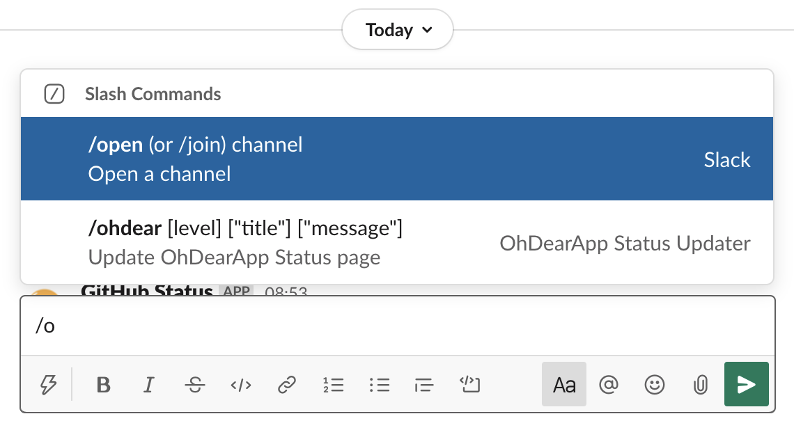
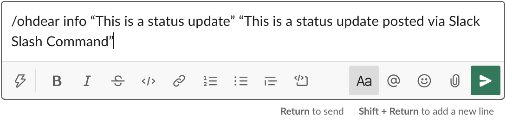
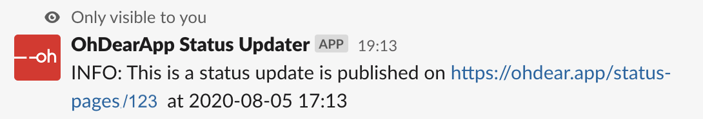

# Oh Dear! Status Updater for Slack

This codebase provides the logic to set up your own endpoint for updating [Oh Dear! Status Pages](https://ohdear.app/feature/status-pages) with custom status messages right from [Slack](https://www.slack.com).

It allows you to stay focussed on team collaboration while providing your customers essential information about service failures, maintenance or upcoming features.

## Requirements

In order to use this functionality, you must meet the following requirements:

- Oh Dear! Subscription
- Slack subscription with permission to install apps
- PHP 7.3 or higher if you want to run it yourself

### Oh Dear! subscription

This code updates the status pages of [Oh Dear!](https://www.ohdear.app/) so you or your company needs to have a subscription with their service. If you don't have one yet, you can register for a 10-day free trial at <https://ohdear.app/register>.

[](https://ohdear.app/register)

### Slack subscription

If you want to use this integration, a [Slack](https://www.slack.com) subscription is required where you have the ability to install apps for your Slack subscription. If you don't have one, you can sign up for free at <https://slack.com/get-started#/>.

[](https://slack.com/get-started#/)

### PHP 7.3 or higher

If you want to run this code base yourself make sure your server has at least PHP 7.3 installed. Higher is always good, but lower versions are not supported. You also need [composer](https://getcomposer.org) to install required dependencies.

## How to set the endpoint up yourself?

**WARNING:** DO NOT INSTALL DEV TOOLS ON PRODUCTION SYSTEMS!

```sh
cd /path/to/installation
git clone https://github.com/DragonBe/ohdear-status-updater.git
composer install --no-dev
```

Point your web server's document root to the `/web` directory of this project. In this example it would be `/path/to/installation/web`.

## How to activate the OhDear Status Updater in Slack?

## How to use the OhDear! Status Updater in Slack?

The updater is a [Slack Slash Command](https://api.slack.com/legacy/custom-integrations/slash-commands), which means you can just use it using the `/` in your chat window to provide quick and immediate status updates.

The structure is `/ohdear <severity> "<status update title>" "<status update message>"` where the required items are:

- slash command: `/ohdear`
- severity: one of info, warning, high, resolved, or scheduled
- status update title: The title for your update message
- status update message: The whole message you want to present on your status page

The moment you type in `/` in the message bar, a dialogue appears showing you a list of commands that are available. The more letters you type, the more focussed this list will become.



Now you can type something like `/ohdear info “This is a status update” “This is a status update posted via Slack Slash Command”` which will post this to your Oh Dear! status page.



You will see a confirmation message in Slack that will give you a bit of feedback about the posted update.



On your Oh Dear! update page the update appears immediately.


## Known problems and restrictions

There's a problem processing unicode characters in the messages, probably has to do with how I filter the incoming text. Keep it plain text for now as I will work to solve this issue soon.

There's a difference in handling timestamps between Oh Dear! and Slack. I have to figure out how time is processed on the different systems to get them alignd correctly.

The link to the status page in the Slack response is not working. I might need to add an additional call to Oh Dear! to get the proper link of the status page or Oh Dear! adds it to their response object.

## License and trademarks

This software is provided as-is and licensed under [MIT License](LICENSE.md). [Oh Dear!](https://www.ohdear.app) is a trademark of [Immutable VOF](https://www.immutable.be/), [Slack](https://www.slack.com) is a trademark of [Slack Technologies, Inc.](https://www.slack.com). This software is not part of Oh Dear! or Slack and they will not provide any support for this software. 